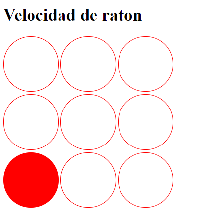
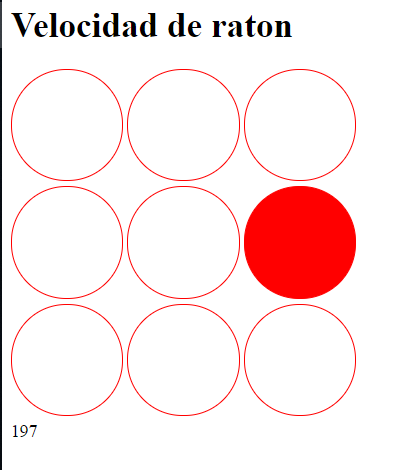
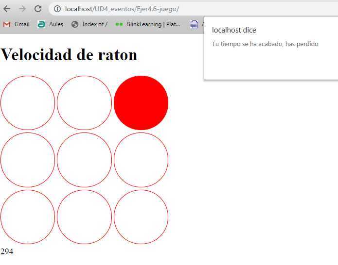

Realiza un programa que cronometre el tiempo que tarda en hacer un clik en un circulo.

Elementos a valorar en la evaluación

* Se pinta el primer circulo
* Al hacer click, solo en ese circulo, cambia a otro circulo
* Al tardar mas de tres segundos, sale el mensaje de fin de juego
* Se realiza el cronómetro

Cuando se haga click en el circulo, inicia el cronometro de decimas de segundo y se pinta en rojo otro circulo, así sucesivamente

Si se tarda mas de 3 segundos, te dice que has perdido

