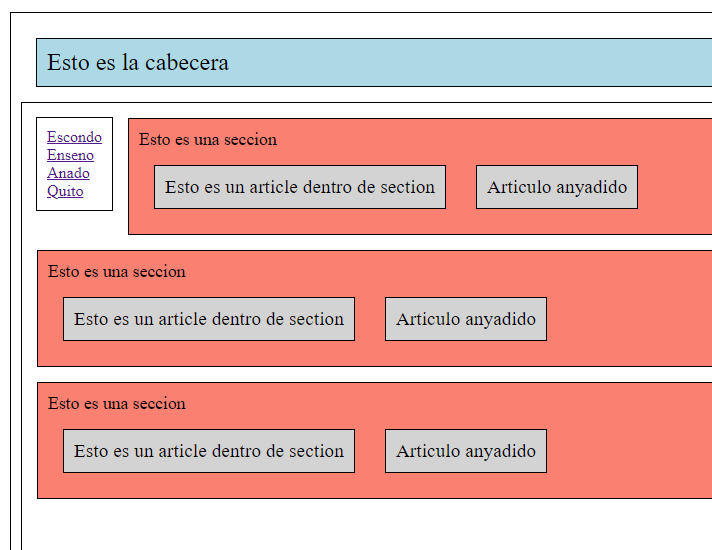

Mediante Jquery, realiza el fichero code.js para que el programa, mediante enlaces:

* Esconder article en todos los sections
* Enseñar article en todos los sections
* Añadir article en todos los sections
* Quitar article en todos los sections

