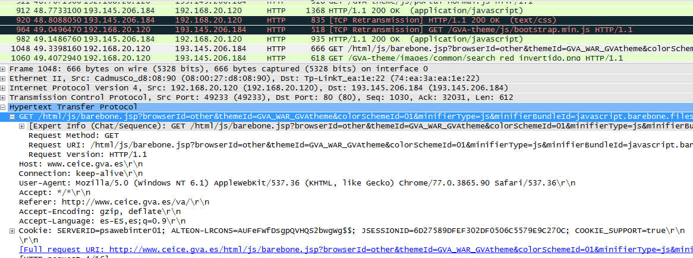

### 1

* 1) 192.145.206.184
* 2) 1.1
* 3) GET
* 4) una página jsp
* 5) www.ceice.gva.es
* 6) Sí
* 7) es-ES
* 8) 200
* 9) Apache
* 10)
* 11) Sí

¿A que nivel TCP/IP pertenece HTTP?¿Y TCP?
* HTTP pertenece a la capa de aplicación
* TCp pertence a la capa de transporte

### CUESTIONARIO

* 1)
Las URIs permiten identificar una parte dentro de un recurso.
Las URLs son tipos de URI que permiten identificar un recurso en la red.

> Estructura URI = protocolo://host:puerto/ruta?parametros#parte

> Estructura URL = protoclo://host[:puerto]/ruta-fichero

* 2)
Una Web estática es aquella página enfocada principalmente a mostrar una información permanente, donde el navegante se limita a obtener dicha información.
En las páginas dinámicas, el contenido suelen generarse en el momento de visualizarse, por tanto puede variar

* 3)
Http - TCP - 80

* 4)
Trata cada petición como una transacción independiente que no tiene relación con cualquier solicitud

* 5)
Los estándares de facto o “de hecho” son aquellos que no han sido desarrollados por ninguna organización de estandarización debidamente acreditada.
Los estándares de iure son estándares formales y legales acordados por algún organismo internacional de estandarización autorizado.

* 6)
Un usuario accede a una URL, seleccionando un enlace de un documento HTML o introduciéndola directamente en el campo Location del cliente Web.
El cliente Web descodifica la URL, separando sus diferentes partes. Así identifica el protocolo de acceso, la dirección DNS o IP del servidor, el posible puerto opcional (el valor por defecto es 80) y el objeto requerido del servidor.
Se abre una conexión TCP/IP con el servidor, llamando al puerto TCP correspondiente.
Se realiza la petición. Para ello, se envía el comando necesario (GET, POST, HEAD,…), la dirección del objeto requerido (el contenido de la URL que sigue a la dirección del servidor), la versión del protocolo HTTP empleada (casi siempre HTTP/1.0) y un conjunto variable de información, que incluye datos sobre las capacidades del browser, datos opcionales para el servidor,…
El servidor devuelve la respuesta al cliente. Consiste en un código de estado y el tipo de dato MIME de la información de retorno, seguido de la propia información.
Se cierra la conexión TCP.

* 7)

* 8)
GET -> peticion para recibir datos
POST -> peticion para mandar datos (se usa para creación)
PUT -> peticion para mandar datos (se usa para actualizar)
DELETE -> peticion para borrar datos

* 9)
Con los dos se pueden enviar datos al servidor pero lo normal es usar el GET para acceder a la información y el POST para enviar datos. Ya que en el GET los parametros van por la URL.

* 10)

* 11)
Los códigos de estado son códigos númericos en el cual nos indica el estado de la petición. los códigos 2xx significan que la petición ha sido exitosa, los 3xx son de redirección, los 4xx son errores de cliente y los 5xx son errores de servidor. ej: 404 es de un recurso no encontrado.

* 12)
Es una forma estandarizada de indicar la naturaleza y el formato de un documento.

* 13)
La cabecera de respuesta HTTP Set-Cookie se usa para enviar cookies desde el servidor al agente de usuario.

* 14)
Es la idea de utilizar la misma conexión TCP para enviar y recibir múltiples peticiones HTTP/respuestas, en lugar de abrir una nueva para cada par petición/respuesta única. El uso de conexiones persistentes es muy importante para mejorar el rendimiento 