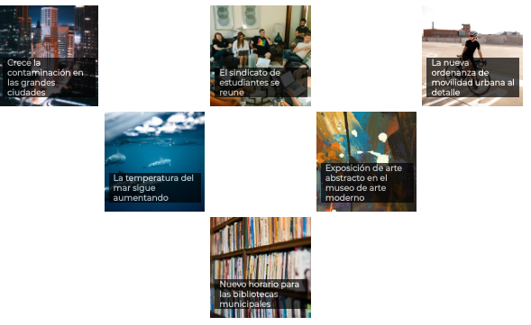

Utiliza GRID CSS para obtener una plantilla de una web de noticias similar a la de la imagen:

Requisitos:

* No ha de haber ningun estilo en los documentos HTML en modo inline, todos estarán en un documento CSS externo.
* Se ha de usar GRID CSS para el diseño de las dos secciones.
* Utiliza fuentes externas para los títulos (se recomienda el uso de Google Font)
* Las imágenes se han de ajustar al tamaño de la celda y crecer/decrecer con él. Puedes obtener imágenes gratuitas de [https://www.pexels.com/](https://www.pexels.com/)
* Los textos de los títulos han de cambiar de tamaño en función del tamaño de la pantalla, para que se puedan leer bien.
* Cuando la pantalla de visualización sea de smartphone (<500px), el diseño se modificará para mostrar todo en una sola columna.

### **Entrega**
Un archivo comprimido con los documentos html  y css generados.

### **Criterios de evaluación (APTO )**
El documento entregado cumple todos los puntos antes citados

### **Ampliación**
Realiza lo siguiente (Recupera nota de NO APTO):

* Se consigue el aspecto requerido usando la etiqueta  para las imágenes (+0,3)
* Modifica el último requisito (visualización en columna para móviles) para que sólo se aplique cuando el terminal esté en vertical(+0,1)
* Cambia el diseño de la sección noticias para que las muestre en cuadrados perfectos y dejando un hueco en blanco entre cada una. Ejemplo: .  (+0,3)
